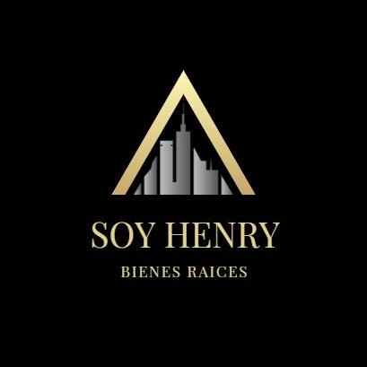

# Team Project - real estate

  

## Objectives

- Build an real state app.
- Research and implement new technologies

## Dependencies versions:

- __react__: 17.0.1
- __react-dom__: 17.0.1
- __react-router-dom__: 5.2.0
- __redux__: 4.0.5
- __react-redux__: 7.2.3
- __pg__: 8.8.0
- __pg-hstore__: 2.3.4
- __nodemailer__: 6.8.0
- __express__: 4.18.2
- __axios__: 1.1.2
- __bcryptjs__: 2.4.3
- __cookie-parser__: 1.4.5
- __body-parser__: 1.19.0
- __jsonwebtoke__: 8.5.1
- __mercadopago__: 1.5.14
- __sass__: 1.55.0
- __sweetalert2__: 11.5.1
- __universal-cookie__: 4.0.4
- __formik__: 2.2.9
- __yup__: 0.32.11

## BoilerPlate

- [ ] No initial BoilerPlate used
